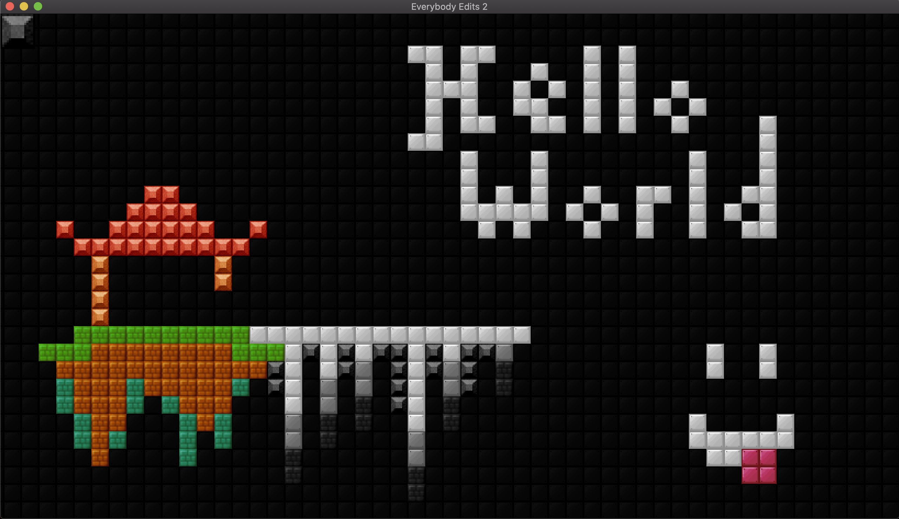

<h1 align='center'><b> 🙃 Everybody Edits 2 🏜 </b></h1>

	
	
	
	

Everybody Edits is originally a Flash game, where the limits is only bounds to the players' creativity.

This project will be an attempt of its sequel, after it has been shutdown upon the
[end of Abode's support for Flash](https://www.adobe.com/products/flashplayer/end-of-life.html),
but will be remade for a better availability and cross-plateform, using CPP as its base language,
with [SMFL](https://www.sfml-dev.org/) for graphics and [Nholomann's JSON](https://github.com/nlohmann/json)
for configurations which are also cross-plateforms.

__Note:__ *Most of the assets currently used comes from the original game, so the credits goes to their original creators!*

__Link to Original Game:__ https://everybodyedits.com/

--------------------

# Showcases

Version: 0.6

--------------------

# Compilation

Before compiling the project, you will need two libraries, there are listed below with the versions used and tested:
 - `SFML`: Graphic library (2.5.1) (https://www.sfml-dev.org/)
 - `Nholomann JSON`: Utility library (3.11.2) (https://github.com/nlohmann/json)

The project is using CMake to compile, it also includes a Makefile with the following rules to simplify steps:
 - `all`: Execute both `build` and `compile` rules
 - `build`: Build the CMake target into a `build` directory
 - `compile`: Compile the project (same as: `make -C build all`)
 - `clean`: Delete the compiled objects and executable (same as: `make -C build clean`)
 - `fullclean`: Delete the entire `build` folder
 - `remake`: Clean and rebuild everything
 - `run`: Compile and run the executable located in `build`