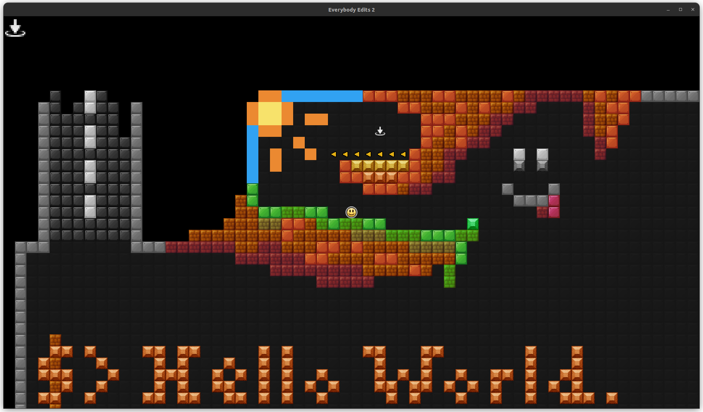
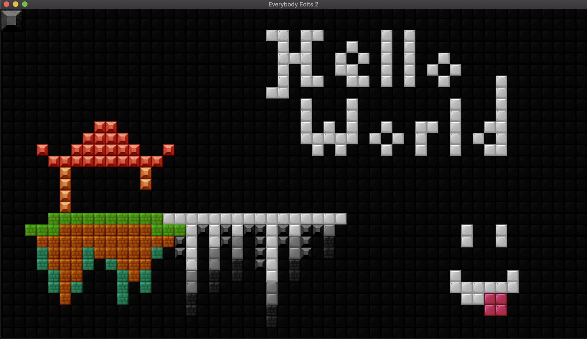

<!-- Github Link: https://github.com/BlankRose/EverybodyEdits2 -->
<h1 align='center'><b> 🙃 Everybody Edits 2 🏜 </b></h1>

	
	
	
	

Everybody Edits is originally a Flash game, where the limits is only bounds to the players' creativity.

This project will be an attempt of its sequel, after it has been shutdown upon the
[end of Abode's support for Flash](https://www.adobe.com/products/flashplayer/end-of-life.html),
but will be remade for a better availability and cross-plateform, using CPP as its base language,
with [SMFL](https://www.sfml-dev.org/) for graphics and [Nholomann's JSON](https://github.com/nlohmann/json)
for configurations which are also cross-plateforms.

I'm also aware lots of other poeple are tyring to remake it aswell, yet this is my attempt.

__Note:__ *Most of the assets currently used comes from the original game, so the credits goes to their original creators!*

__Link to Original Game:__ https://everybodyedits.com/

--------------------

# Progress Showcases

| Version 0.8| Version 0.6|
|--------------------------------------|--------------------------------------|

--------------------

# Compilation

Before compiling the project, you will need two libraries, there are listed below with the versions used and tested:
 - `SFML`: Graphic library (2.6.0) (https://www.sfml-dev.org/)
 - `Nholomann JSON`: Utility library (3.11.2) (https://github.com/nlohmann/json) - INCLUDED

The project is using Makefiles to compile, with the following rules defined to simplify the compilation:
 - `all`: Compile the project into a binary (DEFAULT_GOAL)
 - `clean`: Clear all objects files created during compilation
 - `fullclean`: Clear all objects files AND remove the final executable aswell
 - `remake`: Rebuild from scratch the project (Equivalent: `make fullclean all`)
 - `run`: Execute the binary, compiling it before hand if necessary
 - `run-leak`: Execute with leak-sanitizer, compiling aswell if necessary
 - `debug`: Displays all targetted files and dependacies by the projects

__NOTICE:__ If your library is located anywhere specific, you should change the variable `SEARCHDIR`

--------------------

# Game's Controls

Here's a list of all available controls:

### Movements :
- `[Escape]`: Exit the game
- `[Up]` or `[W]`: Move upward
- `[Left]` or `[A]`: Move to left
- `[Down]` or `[S]`: Move downward
- `[Right]` or `[D]`: Move to right

### Construction :
- `[Numpad 0]` to `[Numpad 4]`: Quick select a tile pack
- `[0]` to `[9]`: Quick pick tile from toolbar
- `[Left Click]` or `[Right Click]`: Place selected tile
- `[Middle Click]`: Copy hovered tile to selection
- `[B]`: Toggle background mode
- `[Shift + B]`: Switch background and foreground on whole toolbar

### Developper :
- `[G]`: Godmode (Freely move around)
- `[I]`: Switch gravity towards up
- `[J]`: Switch gravity towards left
- `[K]`: Switch gravity towards down
- `[L]`: Switch gravity towards right
